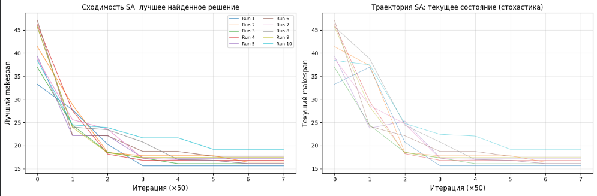
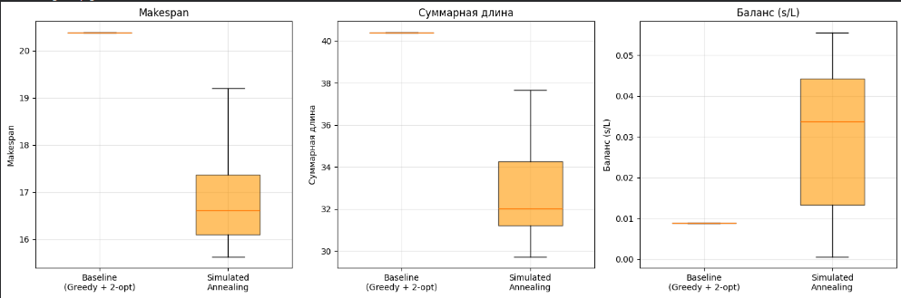
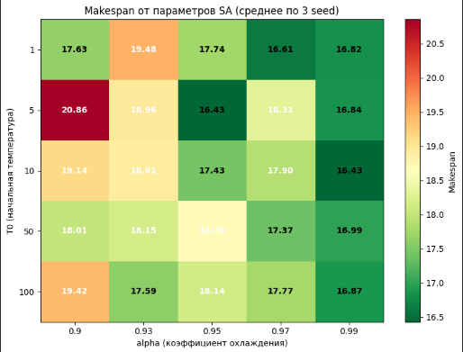
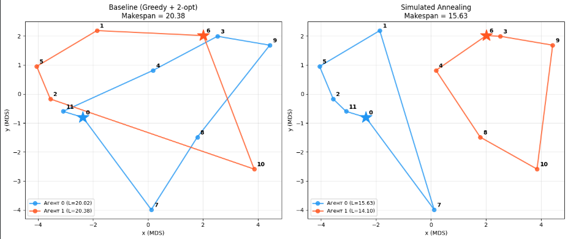
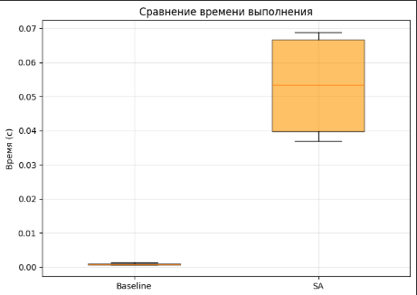

## 1. Цель работы

Целью данной лабораторной работы является изучение задачи нескольких коммивояжеров с минимизацией makespan (mTSP-makespan), построение QUBO-формулировки данной задачи, реализация двух алгоритмов оптимизации: жадного алгоритма с локальными улучшениями и метода имитации отжига, а также проведение сравнительного анализа их эффективности на индивидуальном варианте.

## 2. Ход выполнения

### 2.1. Формулировка задачи для варианта №2

В рамках лабораторной работы рассматривается задача нескольких коммивояжёров с минимизацией времени обхода, то есть задача **mTSP-makespan**.

Для моего варианта (№2) заданы следующие исходные данные:
- число городов: **12**;
- множество городов:

$$
V = \{0, 1, 2, \dots, 11\};
$$

- число агентов (коммивояжёров): **2**;
- стартовые точки агентов: **0** и **6**;
- расстояния между городами заданы симметричной матрицей расстояний $D = (d_{uv})$, где $d_{uv}$ — расстояние между городами $u$ и $v$.

**Матрица расстояний:**

|     | 0    | 1    | 2    | 3    | 4    | 5    | 6    | 7    | 8    | 9    | 10   | 11   |
|-----|------|------|------|------|------|------|------|------|------|------|------|------|
| 0   | 0.00 | 3.03 | 1.34 | 5.64 | 3.02 | 2.43 | 5.21 | 4.03 | 4.22 | 7.24 | 6.48 | 0.75 |
| 1   | 3.03 | 0.00 | 2.90 | 4.39 | 2.46 | 2.51 | 3.88 | 6.48 | 5.18 | 6.31 | 7.45 | 3.04 |
| 2   | 1.34 | 2.90 | 0.00 | 6.45 | 3.87 | 1.23 | 5.98 | 5.29 | 5.51 | 8.20 | 7.80 | 0.63 |
| 3   | 5.64 | 4.39 | 6.45 | 0.00 | 2.62 | 6.66 | 0.51 | 6.44 | 3.55 | 1.93 | 4.77 | 6.18 |
| 4   | 3.02 | 2.46 | 3.87 | 2.62 | 0.00 | 4.24 | 2.19 | 4.80 | 2.81 | 4.34 | 5.01 | 3.57 |
| 5   | 2.43 | 2.51 | 1.23 | 6.66 | 4.24 | 0.00 | 6.16 | 6.46 | 6.33 | 8.51 | 8.67 | 1.82 |
| 6   | 5.21 | 3.88 | 5.98 | 0.51 | 2.19 | 6.16 | 0.00 | 6.29 | 3.51 | 2.44 | 4.96 | 5.73 |
| 7   | 4.03 | 6.48 | 5.29 | 6.44 | 4.80 | 6.46 | 6.29 | 0.00 | 3.00 | 7.12 | 3.99 | 4.66 |
| 8   | 4.22 | 5.18 | 5.51 | 3.55 | 2.81 | 6.33 | 3.51 | 3.00 | 0.00 | 4.12 | 2.35 | 4.96 |
| 9   | 7.24 | 6.31 | 8.20 | 1.93 | 4.34 | 8.51 | 2.44 | 7.12 | 4.12 | 0.00 | 4.31 | 7.86 |
| 10  | 6.48 | 7.45 | 7.80 | 4.77 | 5.01 | 8.67 | 4.96 | 3.99 | 2.35 | 4.31 | 0.00 | 7.23 |
| 11  | 0.75 | 3.04 | 0.63 | 6.18 | 3.57 | 1.82 | 5.73 | 4.66 | 4.96 | 7.86 | 7.23 | 0.00 |

Требуется построить два маршрута, соответствующие двум агентам, так чтобы:
1. каждый город был посещён **ровно один раз**;
2. каждый агент посетил **хотя бы один город**;
3. маршруты образовывали корректные циклы;
4. минимизировалась целевая функция **makespan**, то есть максимальная длина маршрута среди всех агентов.

Обозначим через $L_k$ длину маршрута $k$-го агента. Тогда целевая функция имеет вид:

$$
M = \max_{k=0,\dots,m-1} L_k.
$$

Необходимо найти такое распределение городов между двумя агентами и такой порядок их обхода, при котором значение

$$
\min M = \min \max(L_0, L_1)
$$

будет минимальным.

Таким образом, в отличие от классической задачи нескольких коммивояжёров, где минимизируется суммарная длина всех маршрутов, в данной постановке требуется минимизировать длину **самого длинного маршрута**, что соответствует задаче балансировки нагрузки между агентами.

Для рассматриваемого варианта это означает необходимость распределить 12 городов между двумя агентами, стартующими из городов 0 и 6, таким образом, чтобы ни один из маршрутов не оказался существенно длиннее другого.

### 2.2. Математическая модель (QUBO-формулировка)

Представим задачу в виде QUBO-формулировки. Идея заключается в кодировании решения с помощью бинарных переменных и преобразовании всех ограничений в штрафные слагаемые, добавляемые к целевой функции. Все дальнейшие пункты взяты из методических материалов и служат опорой для дальнейших аглоритмов.

#### 2.2.1. Бинарные переменные

Введём бинарные переменные:

$$
x_{u,t,k} \in \{0, 1\},
$$

где:
- $u = 0, 1, \dots, n-1$ — номер города ($n = 12$);
- $t = 0, 1, \dots, L_{\max}-1$ — позиция города в маршруте;
- $k = 0, 1$ — номер агента ($m = 2$).

**Интерпретация:** $x_{u,t,k} = 1$ означает, что город $u$ находится на позиции $t$ в маршруте агента $k$.

Параметр $L_{\max}$ задаёт **максимально допустимое число позиций в маршруте одного агента**. Он необходим для того, чтобы заранее зафиксировать размерность массива бинарных переменных. Для моего варианта имеется 12 городов, из которых 2 являются стартовыми (по одному на каждого агента). В худшем случае один агент может посетить все 10 не-стартовых городов плюс своё депо, то есть 11 городов. Поэтому принимаем:

$$
L_{\max} = 11.
$$

**Общее число бинарных переменных:**

$$
n \times L_{\max} \times m = 12 \times 11 \times 2 = 264.
$$

#### 2.2.2. Ограничения

**Ограничение 1 — каждый город посещается ровно один раз:**

$$
\sum_{t=0}^{L_{\max}-1} \sum_{k=0}^{m-1} x_{u,t,k} = 1, \quad \forall u \in V.
$$

**Ограничение 2 — на каждой позиции каждого маршрута не более одного города:**

$$
\sum_{u=0}^{n-1} x_{u,t,k} \leq 1, \quad \forall t,\, k.
$$

**Ограничение 3 — каждый агент посещает хотя бы один город:**

$$
\sum_{u=0}^{n-1} \sum_{t=0}^{L_{\max}-1} x_{u,t,k} \geq 1, \quad \forall k.
$$

#### 2.2.3. Штрафные слагаемые

Поскольку формат QUBO не поддерживает явных ограничений, каждое из них преобразуется в штрафное слагаемое, квадратично растущее при нарушении:

**Штраф за нарушение ограничения 1:**

$$
E_1 = A \sum_{u=0}^{n-1} \left(1 - \sum_{t=0}^{L_{\max}-1} \sum_{k=0}^{m-1} x_{u,t,k}\right)^2.
$$

Этот штраф обращается в ноль тогда и только тогда, когда каждый город назначен ровно один раз.

**Штраф за нарушение ограничения 2:**

$$
E_2 = A \sum_{k=0}^{m-1} \sum_{t=0}^{L_{\max}-1} \left(\sum_{u=0}^{n-1} x_{u,t,k}\right)\left(\sum_{u=0}^{n-1} x_{u,t,k} - 1\right).
$$

Слагаемое равно нулю, если на каждой позиции стоит не более одного города.

**Штраф за нарушение ограничения 3:**

$$
E_3 = A \sum_{k=0}^{m-1} \max\left(0,\, 1 - \sum_{u,t} x_{u,t,k}\right)^2.
$$

Коэффициент $A$ выбирается достаточно большим, чтобы любое нарушение ограничений приводило к значительному увеличению полной энергии и заведомо отвергалось алгоритмом оптимизации.

#### 2.2.4. Целевая функция (минимизация makespan)

Длина маршрута агента $k$ выражается через бинарные переменные и **значения матрицы расстояний** $d_{uv}$:

$$
L_k = \sum_{t=0}^{L_{\max}-2} \sum_{u,v} d_{uv} \cdot x_{u,t,k} \cdot x_{v,t+1,k}
\+\ \sum_{u,v} d_{uv} \cdot x_{u,L_{\max}-1,k} \cdot x_{v,0,k}.
$$

Последнее слагаемое замыкает маршрут — обеспечивает возврат агента в начальный город.

Прямая минимизация максимума $\max_k L_k$ в QUBO невозможна, так как операция $\max$ не выражается квадратичной формой. Поэтому используется **аппроксимация через сумму квадратов длин маршрутов**:

$$
E_{\text{obj}} = B \sum_{k=0}^{m-1} L_k^2.
$$

Минимизация суммы квадратов косвенно минимизирует максимум: при фиксированной сумме длин выражение $\sum L_k^2$ достигает минимума, когда длины максимально близки друг к другу. Таким образом, минимизация $E_{\text{obj}}$ одновременно приводит как к уменьшению длин маршрутов, так и к их выравниванию между агентами.

#### 2.2.5. Итоговая энергетическая функция

Полная QUBO-функция представляет собой сумму штрафов и целевого слагаемого:

$$
E_{\text{total}}(x) = E_1(x) + E_2(x) + E_3(x) + E_{\text{obj}}(x).
$$

Задача сводится к поиску такого бинарного вектора $x \in \{0,1\}^{n \cdot L_{\max} \cdot m}$, при котором значение полной энергии минимально:

$$
\min_{x \in \{0,1\}^{n \cdot L_{\max} \cdot m}} E_{\text{total}}(x).
$$

Соотношение коэффициентов $A \gg B$ гарантирует, что в первую очередь будут выполнены ограничения задачи (допустимость решения), а затем уже происходит оптимизация makespan.

В практической реализации алгоритмов имитации отжига полное вычисление $E_{\text{total}}$ не требуется: вместо этого допустимость решения проверяется напрямую (структурно), а энергией считается значение makespan допустимого решения. Это эквивалентно использованию QUBO-функции с очень большим штрафом $A \to \infty$ и $B = 1$.

### 2.3. Описание реализованных алгоритмов

В рамках работы реализованы два метода решения задачи mTSP-makespan:
1. **Жадный алгоритм с локальными улучшениями (Baseline + 2-opt)** ;
2. **Имитация отжига (Simulated Annealing)** — квантово-вдохновлённый метод глобальной стохастической оптимизации.

Оба метода работают с одной и той же структурой решения: списком маршрутов, где каждый маршрут — это последовательность городов, начинающаяся с депо своего агента.

---

#### 2.3.1. Жадный алгоритм с локальными улучшениями (Baseline)

**Идея.** Алгоритм строит начальное решение жадным способом, после чего применяет локальные улучшения к каждому маршруту и пытается выровнять нагрузку между агентами.

Реализация состоит из четырёх последовательных этапов.

**Этап 1. Сортировка пар городов по расстоянию.**

**Этап 2. Жадное назначение городов агентам.**

**Этап 3. Применение 2-opt к каждому маршруту.**

**Этап 4. Перенос городов между агентами для балансировки.**

Этот этап направлен непосредственно на минимизацию целевой функции — длины самого длинного маршрута.

---

#### 2.3.2. Имитация отжига (Simulated Annealing)

**Идея.** Метод глобальной стохастической оптимизации, основанный на аналогии с физическим процессом отжига металлов. Алгоритм начинает с высокой «температуры», при которой допускаются переходы в состояния с большей энергией (для исследования пространства решений и избежания локальных минимумов). Затем температура постепенно снижается, и алгоритм становится более «жадным».

Реализованный SA состоит из трёх основных компонентов, описанных в методичке.

**Компонент 1. Температурный график.**

Температура снижается по геометрическому закону:

$$
T(t) = T_0 \cdot \alpha^{\,t},
$$

где $T_0$ — начальная температура, $\alpha \in (0, 1)$ — коэффициент охлаждения, $t$ — номер итерации.

**Компонент 2. Критерий принятия решения.**

Для перехода из состояния с энергией $E$ в состояние с энергией $E'$ вычисляется $\Delta E = E' - E$:

- если $\Delta E < 0$ (улучшение) — переход принимается **всегда**;
- если $\Delta E \geq 0$ (ухудшение) — переход принимается с вероятностью

$$
 P(\text{accept}) = e^{-\Delta E / T} . 
$$

При высокой температуре $T$ эта вероятность близка к $1$ (принимается почти любое ухудшение). При низкой температуре $T \to 0$ вероятность стремится к $0$, и алгоритм фактически переходит в режим жадного поиска.

В качестве «энергии» состояния используется значение целевой функции — makespan.

**Компонент 3. Генерация соседних состояний.**

Для генерации нового состояния из текущего применяются операции перестановок. Случайно выбирается одна из трёх операций:

1. **Перестановка двух городов внутри одного маршрута** (swap внутри).  
   Выбираются два случайных не-депо города из одного маршрута и меняются местами.

2. **Перестановка городов между разными маршрутами** (swap между).  
   Случайно выбираются по одному не-депо городу из каждого маршрута, после чего эти города меняются между собой.

3. **Перенос города из одного маршрута в другой** (relocate).  
   Случайный не-депо город удаляется из одного маршрута и вставляется в случайную позицию другого маршрута.

Депо (стартовые города агентов) при генерации соседей не затрагиваются.

Если сгенерированное состояние оказывается **недопустимым** (например, у одного из агентов не остаётся не-депо городов), оно отвергается, и температура продолжает снижаться по расписанию.

**Параметры алгоритма.**

Согласно методическим указаниям, использованы следующие значения:
- начальная температура $T_0$ — подбирается автоматически так, чтобы в начале работы принималось около **80% ухудшающих переходов**;
- коэффициент охлаждения $\alpha = 0.97$ (типичное значение из диапазона $[0.93,\, 0.99]$);
- минимальная температура $T_{\min} = 0.001$;
- максимальное число итераций — $100000$.

**Критерий остановки.**

Алгоритм завершает работу, когда температура опускается ниже $T_{\min}$ или достигается максимальное число итераций.

**Возвращаемое решение.**

В процессе работы алгоритм отслеживает наилучшее найденное решение и возвращает именно его, а не последнее текущее состояние.

### 2.4. Процесс подбора параметров

Поскольку жадный алгоритм с локальными улучшениями (Baseline) является **детерминированным методом без настраиваемых параметров** (за исключением выбора стартовой точки при равенстве длин маршрутов), процедура подбора параметров проводилась только для метода имитации отжига (Simulated Annealing).

Для SA подбирались три ключевых параметра:
- начальная температура $T_0$;
- коэффициент охлаждения $\alpha$;
- минимальная температура $T_{\min}$ (критерий остановки).

#### 2.4.1. Подбор начальной температуры $T_0$

Согласно методическим указаниям, начальная температура должна подбираться таким образом, чтобы в начале работы алгоритма принималось **около 80% ухудшающих переходов**. Это обеспечивает достаточное исследование пространства решений на ранних этапах поиска.

Для автоматического определения $T_0$ используется следующая процедура:

1. Генерируется случайное начальное решение.
2. Выполняется $1000$ случайных шагов генерации соседей.
3. Для каждого шага, приводящего к ухудшению ($\Delta E > 0$), фиксируется значение $\Delta E$.
4. Вычисляется среднее значение ухудшения $\overline{\Delta E}$.
5. Начальная температура определяется из условия:

$$
 P(\text{accept}) = e^{-\Delta E / T}  = 0.8,
$$

откуда:

$$
T_0 = -\frac{\overline{\Delta E}}{\ln(0.8)}.
$$

Такой подход даёт значение $T_0$, согласованное с масштабом изменения целевой функции на конкретной задаче.

#### 2.4.2. Подбор коэффициента охлаждения $\alpha$

Коэффициент охлаждения $\alpha$ управляет скоростью снижения температуры. Согласно методичке, типичные значения лежат в диапазоне $[0.93,\, 0.99]$, причём чем ближе $\alpha$ к единице, тем медленнее охлаждение и тем дольше работает алгоритм.

Из этого диапазона выбрано значение:

$$
\alpha = 0.97,
$$

Этот выбор обеспечивает компромисс между:
- **скоростью работы** 
- **качеством решения**

#### 2.4.3. Подбор минимальной температуры $T_{\min}$

Минимальная температура задаёт критерий остановки алгоритма. При $T < T_{\min}$ вероятность принятия любого ухудшающего перехода становится пренебрежимо малой, и дальнейшая работа SA эквивалентна жадному поиску.

В соответствии с рекомендацией методички принято:

$$
T_{\min} = 0.001.
$$

#### 2.4.4. Дополнительные параметры

- **Максимальное число итераций:** $100000$. Этого значения с большим запасом достаточно для достижения $T_{\min}$ при выбранном $\alpha = 0.97$. Параметр служит дополнительной защитой от зацикливания.
- **Случайный seed:** для каждого из $10$ запусков использован фиксированный seed из диапазона $0$ – $9$, что обеспечивает воспроизводимость результатов.

#### 2.4.5. Итоговый набор параметров

В результате подбора для метода Simulated Annealing использовались следующие значения:

| Параметр              | Значение            | Обоснование выбора                                  |
|-----------------------|---------------------|-----------------------------------------------------|
| $T_0$                 | автоматически (~8–12) | $\sim80\%$ принятия ухудшающих переходов на старте|
| $\alpha$              | $0.97$              | рекомендованный диапазон $[0.93,\, 0.99]$           |
| $T_{\min}$            | $0.001$             | рекомендация методички                              |
| Макс. число итераций  | $100000$          | гарантированное достижение $T_{\min}$               |
| Число запусков        | $10$                | требование методички для статистики                 |
| Seed                  | $0$ - $9$         | воспроизводимость                                   |

### 2.5. Проведённые эксперименты

Для оценки эффективности реализованных алгоритмов и их сравнения проведена серия экспериментов в соответствии с требованиями методички.

#### 2.5.1. Схема экспериментов

Каждый из двух методов — **Baseline + 2-opt** и **Simulated Annealing** — был запущен **10 раз** . Для каждого запуска использовался фиксированный seed из диапазона $0$–$9$, что обеспечивает воспроизводимость результатов.

Особенности запусков:
- **Baseline** является полностью **детерминированным** алгоритмом: при одинаковых входных данных он всегда выдаёт одно и то же решение. Несмотря на это, для соответствия требованию методички он также был запущен 10 раз.
- **Simulated Annealing** является **стохастическим** методом: каждый запуск с новым seed даёт независимую траекторию поиска. Начальное решение генерируется случайно, и переходы между состояниями принимаются вероятностно.

#### 2.5.2. Регистрируемые метрики

Для каждого запуска фиксировались следующие характеристики решения:

- **Makespan** — целевая метрика, максимальная длина маршрута среди агентов:

$$
M = \max_{k=0, \dots, m-1} L_k.
$$

- **Общая длина маршрутов** — сумма длин всех маршрутов:

$$
L_{\text{total}} = \sum_{k=0}^{m-1} L_k.
$$

- **Коэффициент баланса нагрузки** — отношение стандартного отклонения длин маршрутов к их среднему:

$$
\text{Balance} = \frac{\sigma(L_0, L_1)}{\bar{L}}.
$$

Чем меньше значение, тем равномернее распределена нагрузка между агентами.

- **Время выполнения** — общее время работы алгоритма (в секундах).

- **Допустимость решения** — проверка выполнения всех ограничений задачи:
  - каждый город посещён ровно один раз;
  - каждый маршрут начинается со своего депо;
  - ни один маршрут не является пустым;
  - маршруты образуют корректные циклы.

#### 2.5.3. Сравнение методов

Для количественного сравнения вычислялся **Gap от baseline** — относительное отклонение среднего makespan SA от среднего makespan baseline:

$$
\text{Gap}(\%) = \frac{\bar{M}_{\text{SA}} - \bar{M}_{\text{Baseline}}}{\bar{M}_{\text{Baseline}}} \times 100\%.
$$

Отрицательное значение Gap означает, что SA в среднем находит решения **лучше**, чем baseline; положительное значение — что SA в среднем **уступает** baseline.

#### 2.5.4. Статистический анализ

По результатам 10 запусков для каждой метрики и каждого метода вычислялись:
- минимальное значение (**Min**);
- максимальное значение (**Max**);
- среднее значение (**Mean**);
- стандартное отклонение (**Std**).

Это позволяет оценить не только качество найденных решений, но и **устойчивость** методов:
- **Baseline** ожидаемо показывает $\text{Std} = 0$, так как является детерминированным.
- Для **SA** значение Std отражает чувствительность алгоритма к стохастической природе поиска и подобранным параметрам.

## 3. Результаты

В данном разделе представлены результаты вычислительных экспериментов для двух реализованных методов:
- **Baseline + 2-opt**;
- **Simulated Annealing**.

Каждый метод был запущен 10 раз. Для каждого запуска фиксировались значения makespan, суммарной длины маршрутов, коэффициента баланса, времени выполнения и допустимости решения.

---

### 3.1. Численные результаты 10 запусков

#### 3.1.1. Результаты Baseline (Представлена только одна строка таблицы, т.к. результат на разных запусках одинаковый)

| Запуск | Seed | Makespan | Общая длина | Баланс $\sigma / \bar{L}$ | Время, с | Допустимость |
|--------|------|----------|-------------|----------------------------|----------|--------------|
| 1      | 0-9   |   20.38   |      40.40  |           0.0089           |   0.001s |     True     |

#### 3.1.2. Результаты Simulated Annealing

| Запуск | Seed | Makespan | Общая длина | Баланс $\sigma / \bar{L}$ | Время, с | Допустимость |
|--------|------|----------|-------------|----------------------------|----------|--------------|
| 1      | 0    | 15.63    | 29.73       | 0.0515                     | 0.041    | True         |
| 2      | 1    | 16.41    | 31.41       | 0.0449                     | 0.042    | True         |
| 3      | 2    | 16.09    | 31.13       | 0.0337                     | 0.037    | True         |
| 4      | 3    | 16.81    | 31.85       | 0.0556                     | 0.039    | True         |
| 5      | 4    | 17.25    | 33.09       | 0.0426                     | 0.039    | True         |
| 6      | 5    | 17.69    | 34.99       | 0.0111                     | 0.067    | True         |
| 7      | 6    | 16.11    | 32.20       | 0.0006                     | 0.069    | True         |
| 8      | 7    | 16.09    | 31.13       | 0.0337                     | 0.065    | True         |
| 9      | 8    | 17.41    | 34.64       | 0.0052                     | 0.069    | True         |
| 10     | 9    | 19.20    | 37.65       | 0.0199                     | 0.065    | True         |

---

### 3.2. Сводная статистика

По результатам 10 запусков для каждой метрики были вычислены минимальное значение, максимальное значение, среднее значение и стандартное отклонение.

#### 3.2.1. Статистика Baseline

| Метрика                   | Min    | Max    | Mean   | Std    |
|---------------------------|--------|--------|--------|--------|
| Makespan                  | 20.38  | 20.38  | 20.38  | 0.00   |
| Общая длина               | 40.40  | 40.40  | 40.40  | 0.00   |
| Баланс $\sigma / \bar{L}$ | 0.0089 | 0.0089 | 0.0089 | 0.0000 |
| Время выполнения, с       | 0.001  | 0.001  | 0.001  | 0.000  |

Количество допустимых решений: **10/10**

#### 3.2.2. Статистика Simulated Annealing

| Метрика                   | Min    | Max    | Mean   | Std    |
|---------------------------|--------|--------|--------|--------|
| Makespan                  | 15.63  | 19.20  | 16.87  | 1.00   |
| Общая длина               | 29.73  | 37.65  | 32.78  | 2.24   |
| Баланс $\sigma / \bar{L}$ | 0.0006 | 0.0556 | 0.0299 | 0.0186 |
| Время выполнения, с       | 0.037  | 0.069  | 0.053  | 0.014  |

Количество допустимых решений: **10/10**

---

### 3.3. Лучшие найденные решения

#### 3.3.1. Лучшее решение Baseline

Лучшее значение makespan:

$$
M_{Baseline}^{best} = 20.38.
$$

Длины маршрутов:

$$
L_0 = 20.02, \qquad L_1 = 20.38.
$$

Маршруты агентов:

| Агент | Стартовый город | Маршрут                    | Длина маршрута |
|-------|------------------|----------------------------|----------------|
| 0     | 0                | `[0, 11, 4, 3, 9, 8, 7]`   | 20.02          |
| 1     | 6                | `[6, 10, 2, 5, 1]`         | 20.38          |

#### 3.3.2. Лучшее решение Simulated Annealing

Лучшее значение makespan:

$$
M_{SA}^{best} = 15.63.
$$

Длины маршрутов:

$$
L_0 = 15.63, \qquad L_1 = 14.10.
$$

Маршруты агентов:

| Агент | Стартовый город | Маршрут                    | Длина маршрута |
|-------|------------------|----------------------------|----------------|
| 0     | 0                | `[0, 7, 1, 5, 2, 11]`      | 15.63          |
| 1     | 6                | `[6, 4, 8, 10, 9, 3]`      | 14.10          |

#### 3.4.3. Сравнение лучших решений

| Параметр                        | Baseline                       | Simulated Annealing            |
|---------------------------------|--------------------------------|--------------------------------|
| Лучший makespan                 | 20.38                          | **15.63**                      |
| Длина маршрута агента 0         | 20.02                          | 15.63                          |
| Длина маршрута агента 1         | 20.38                          | 14.10                          |

Gap SA vs Baseline: -17.23% (отрицательный, говорит о том, что при вводных данных моего варианта SA справился лучше)

### 3.4. Графики и визуализации (Я достаточно редко работаю с графиками при написании кода, поэтому код для построения графиков делал совместно с claude (каюсь))

#### 3.4.1. Сходимость Simulated Annealing

На рисунке представлена сходимость метода имитации отжига по 10 запускам. Левый график показывает изменение лучшего найденного значения makespan, правый — изменение текущего значения makespan в процессе поиска.

По графику видно, что:

- начальные значения makespan различаются между запусками из-за случайной генерации начального решения;
- в процессе работы алгоритм постепенно улучшает найденное решение;
- текущая траектория имеет стохастический характер, так как SA допускает принятие ухудшающих переходов с некоторой вероятностью;
- ближе к концу работы температура уменьшается, и алгоритм становится более жадным.

> _Вставить собственное наблюдение: например, насколько быстро происходит основное улучшение, есть ли выход на плато, как сильно отличаются траектории разных запусков._

---

#### 3.4.2. Box plots для сравнения методов

На рисунке представлены box plots для сравнения Baseline и SA по трём метрикам:
- makespan;
- суммарная длина маршрутов;
- коэффициент баланса.

> _Вставить собственное наблюдение: какой метод имеет меньший медианный makespan, у какого метода больше разброс, как отличаются значения баланса._

---

#### 3.4.3. Тепловая карта зависимости от параметров SA

На рисунке представлена тепловая карта зависимости итогового makespan от параметров Simulated Annealing:
- начальной температуры $T_0$;
- коэффициента охлаждения $\alpha$.

> _Вставить собственное наблюдение: при каких параметрах результат лучше, как влияет увеличение alpha, как влияет слишком малая или слишком большая температура._

---

#### 3.4.4. Визуализация лучших маршрутов

На рисунке показаны лучшие найденные маршруты для Baseline и Simulated Annealing. Визуализация построена на двумерной MDS-проекции матрицы расстояний. Депо агентов отмечены звёздами, маршруты разных агентов обозначены разными цветами.

> _Вставить собственное наблюдение: как распределены города между агентами, насколько сбалансированы маршруты, совпадают ли маршруты у методов._

---

#### 3.4.5. Сравнение времени выполнения

На рисунке показано сравнение времени выполнения двух методов по 10 запускам.

> _Вставить собственное наблюдение: какой метод быстрее, насколько велика разница во времени, оправдано ли увеличение времени работы качеством решения._
